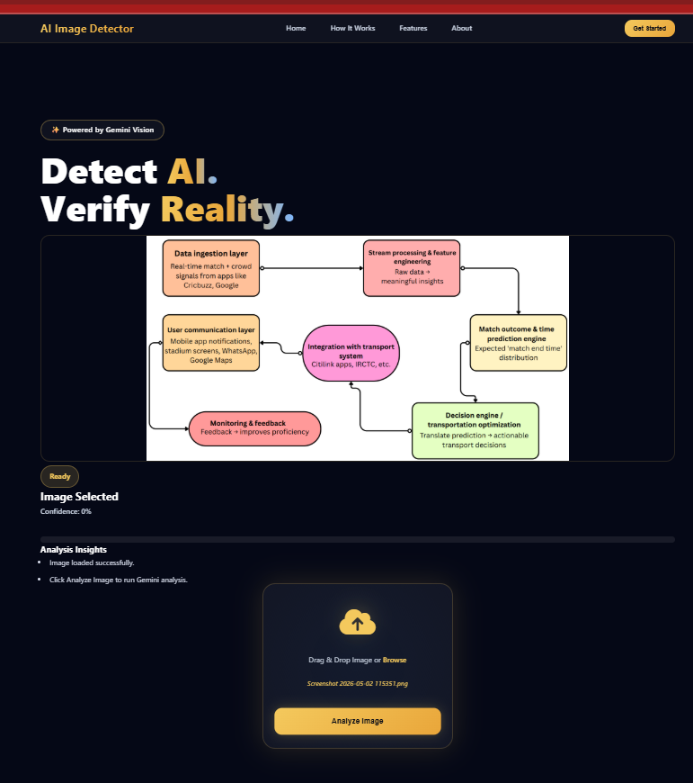
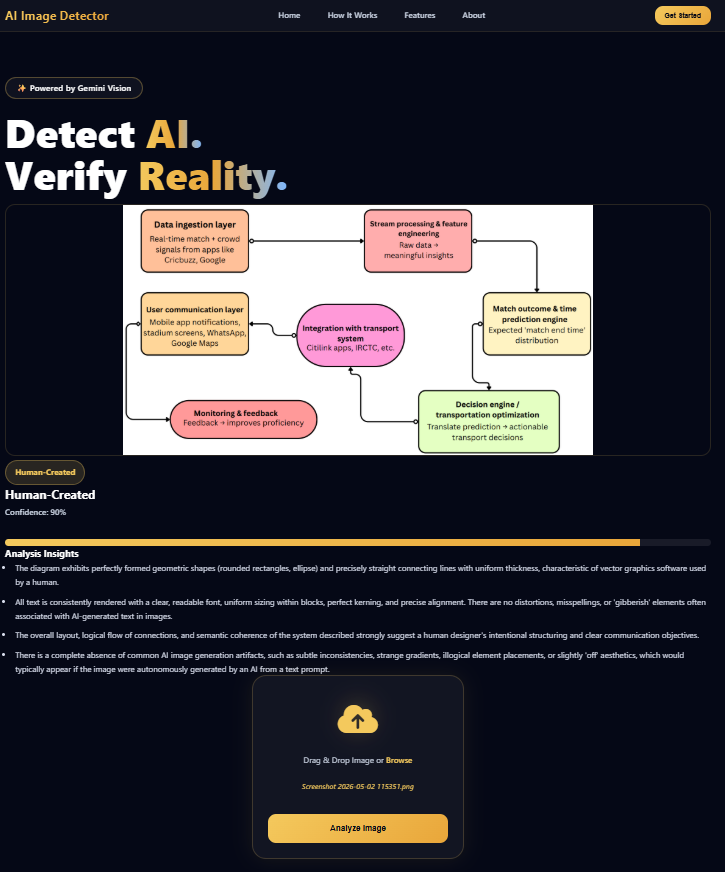

# AI Image Detection

A Flask-based web application that uses Google's Gemini Vision model to analyze images and estimate whether they appear Human-Created or AI-Generated.

## Features

* Image upload and drag-and-drop support
* Live image preview
* Gemini Vision powered analysis
* Confidence score visualization
* Detailed reasoning and insights
* Modern responsive UI
* Secure API key handling using `.env`

## Tech Stack

* Python
* Flask
* HTML
* CSS
* JavaScript
* Google Gemini API

## Screenshots

### Home Page


### Image Preview



### Analysis Result



## Installation

Clone the repository:

```bash
git clone https://github.com/ShantanuPatil11/AI-Image-Detection.git
```

Install dependencies:

```bash
pip install flask python-dotenv google-genai
```

Create a `.env` file:

```env
GEMINI_API_KEY=YOUR_API_KEY_HERE
```

Run the application:

```bash
python app.py
```

Open:

```text
http://127.0.0.1:5000
```

## Project Structure

```text
AI-Image-Detection
│
├── static
│   ├── style.css
│   └── script.js
│
├── templates
│   └── index.html
│
├── screenshots
│
├── app.py
├── README.md
└── .gitignore
```

## Author

Shantanu Patil
